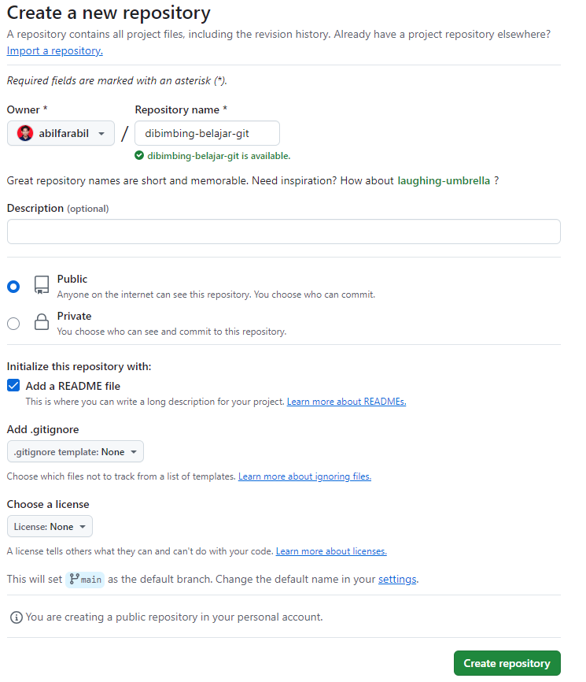
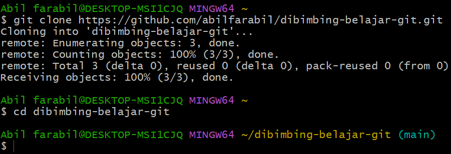
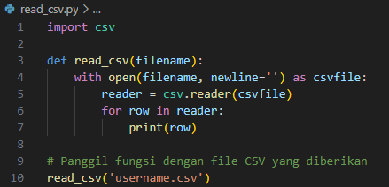
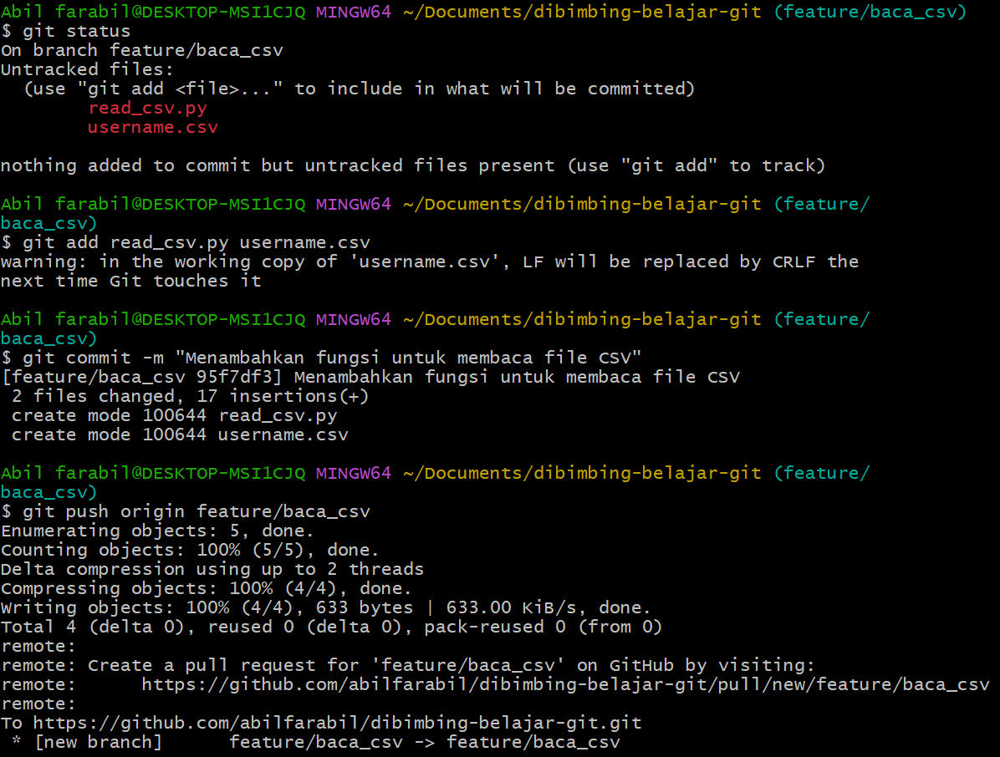
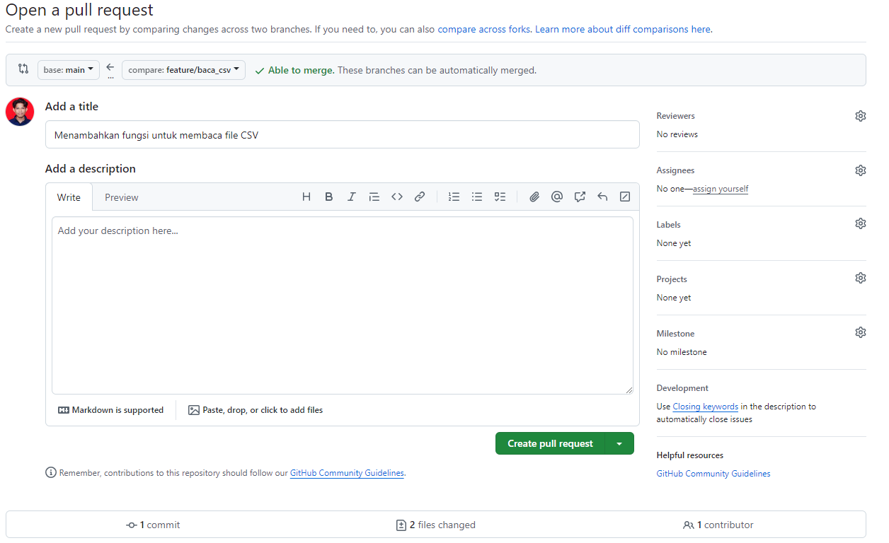
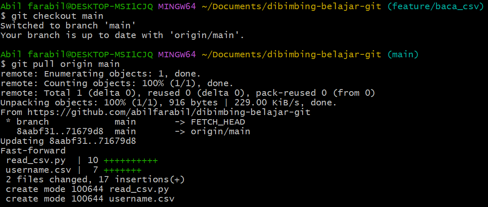

# Dibimbing Belajar GitHub

## Deskripsi Project
Repository ini dibuat sebagai bagian dari tugas dalam Bootcamp Data Engineer, yang bertujuan untuk mempraktikkan penggunaan Git, mulai dari pembuatan repository, branching, commit, hingga pull request. Selain itu, repository ini juga berisi file Python untuk membaca file CSV yang diberikan.

## File dalam Repository
1. **username.csv**: File CSV yang diberikan untuk tugas.
2. **read_csv.py**: Script Python yang berisi fungsi untuk membaca dan menampilkan isi dari file CSV.

## Langkah-langkah Project

### 1. Membuat Repository di GitHub
Repository GitHub dengan nama `dibimbing-belajar-github` dibuat untuk Project ini.

### 2. Clone Repository ke Local
Repository di-clone ke direktori lokal menggunakan perintah `git clone`.

### 3. Membuat File Python untuk Membaca File CSV
File Python `read_csv.py` dibuat dengan fungsi untuk membaca dan menampilkan isi dari `username.csv`.

### 4. Membuat Branch Baru
Branch baru dengan nama `feature/baca_csv` dibuat untuk menambahkan fitur pembacaan file CSV.

### 5. Commit dan Push File ke Branch Baru
File `read_csv.py` di-commit dan di-push ke branch `feature/baca_csv`.

### 6. Membuat Pull Request
Pull request dibuat dan di-merge ke branch `main`.

### 7. Pull Perubahan dari Remote ke Local
Perubahan yang telah di-merge ke branch `main` di-pull ke repository lokal.

## Kesimpulan
Dalam Project ini, saya telah berhasil:
- Membuat dan mengelola repository GitHub.
- Membuat branch, melakukan commit, dan push ke repository.
- Membuat pull request dan melakukan merge ke branch utama.
- Membaca dan menampilkan data dari file CSV menggunakan Python.

## Referensi
- [Dokumentasi Git](https://git-scm.com/doc)
- [Dokumentasi Python CSV](https://docs.python.org/3/library/csv.html)
