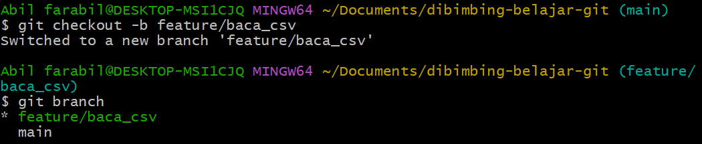

# Git and Python Project for Reading CSV Files

## Project Description
This repository was created as part of the assignment in the Data Engineer Bootcamp, aimed at practicing the use of Git, from repository creation, branching, committing, to pull requests. Additionally, this repository also contains a Python file for reading the provided CSV file.

## Files in the Repository
1. **username.csv**: The CSV file provided for the assignment.
2. **read_csv.py**: A Python script that contains a function to read and display the contents of the CSV file.

## Project Steps

### 1. Creating a Repository on GitHub
A GitHub repository named `dibimbing-belajar-github` was created for this project.

### 2. Cloning the Repository Locally
The repository was cloned to the local directory using the command `git clone`.

### 3. Creating a Python File to Read the CSV File
The Python file `read_csv.py` was created with a function to read and display the contents of `username.csv`.

### 4. Creating a New Branch
A new branch named `feature/read_csv` was created to add the CSV reading feature.

### 5. Committing and Pushing to the New Branch
The file `read_csv.py` was committed and pushed to the `feature/read_csv` branch.

### 6. Creating a Pull Request
A pull request was created and merged into the `main` branch.

### 7. Pulling Changes from Remote to Local
The changes that were merged into the `main` branch were pulled into the local repository.

## Conclusion
In this project, I successfully:
- Created and managed a GitHub repository.
- Created branches, committed, and pushed to the repository.
- Created a pull request and merged it into the main branch.
- Read and displayed data from a CSV file using Python.

## References
- [Git Documentation](https://git-scm.com/doc)
- [Python CSV Documentation](https://docs.python.org/3/library/csv.html)
